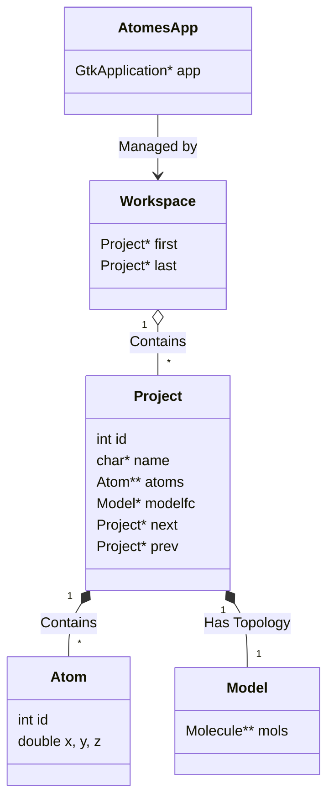
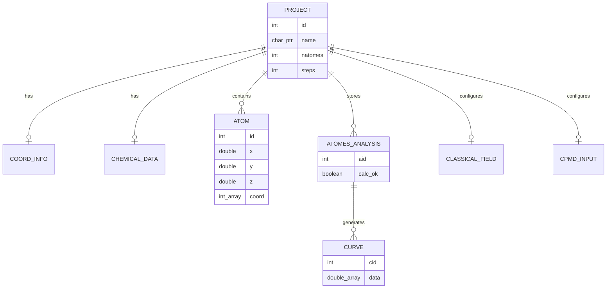
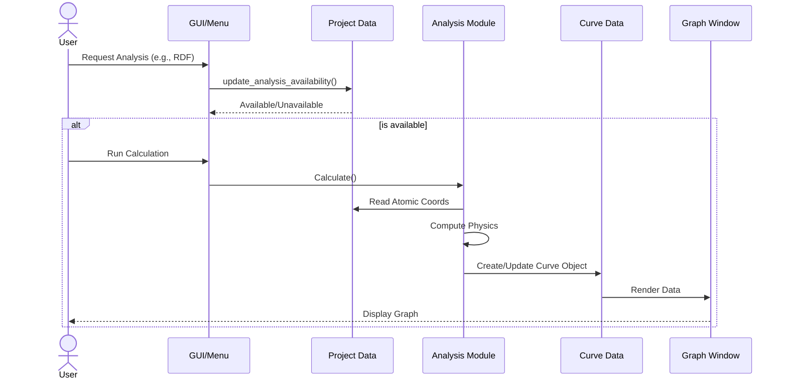

# Developer documentation for atomes

This document provides a brief technical overview of the **atomes** software architecture  
intended for developers who want to contribute to the project. 

It provides some guidlines to get started with [atomes][atomes] development, 
and briefly covers the internal organization, core data structures, and the implementation of key features.

To get started with [atomes][atomes] development, please give a look to the code source documentation: 

[https://slookeur.github.io/atomes-doxygen/index.html](https://slookeur.github.io/atomes-doxygen/index.html)

Please consider that: 

  - Any new file / function should include approriate description and commentary in the [Doxygen](https://www.doxygen.nl/) format
  - Changes to atomes should be submitted for review through pull-request.

Documentation is available to help you with:

  - [Adding a new C code routine to the **atomes** program][new_routine]
  - [Adding new source code file(s) to the **atomes** program][new_file]
  - [Adding a new analysis to the **atomes** program][new_analysis] to make use of the graph visualization system

## Internal organization

The application is built around a hierarchical structure managed by global state variables. The core hierarchy is:

**[AtomesApp][AtomesApp] -> [Workspace][struct workspace] -> [Project][struct project] -> [Model][struct model] -> [Atom][struct atom]**

### Global state (`global.h`)

The application state is maintained through several key global variables defined in [`src/global.h`][global.h]:

- **[`AtomesApp`][AtomesApp]**: The main GTK application instance.
- **`workzone`**: The global [`workspace`][struct workspace] structure containing all open [projects][struct project].
- **`active_project`**: Pointer to the currently selected [`project`][struct project].
- **`active_glwin`**: Pointer to the active OpenGL widget ([`glwin`][struct glwin]).
- **`active_chem`**, **`active_coord`**, **`active_cell`**: Shortcuts to the [chemical data][struct chemical_data], [coordination info][struct coord_info], and [unit cell][struct cell_info] of the active project.

### Workspace and projects

- **Workspace** ([`struct workspace`][struct workspace]): A doubly linked list acting as a container for all open projects (`first` and `last` pointers).
- **Project** ([`struct project`][struct project]): The central data structure that contains:
    - **Metadata**: Name, ID, file paths.
    - **Simulation Data**: `natomes` (atom count), `steps` (MD steps), `box` (simulation box).
    - **Core Data Pointers**:
        - `atoms`: 2D array of [`atom`][struct atom] pointers (`atoms[step][atom_index]`).
        - `coord`: [Coordination statistics][struct coord_info].
        - `chemistry`: [Chemical properties][struct chemical_data].
        - `analysis`: [Analysis results][struct atomes_analysis].
    - **UI Elements**: OpenGL widget ([`modelgl`][struct glwin]), text buffers.
    - **Linked List**: `next` and `prev` pointers for workspace navigation.

## Core data structures

### Atom ([`struct atom`][struct atom])

The fundamental unit of data.
- **Identification**: `id` (index), `sp` (species index).
- **Position**: `x`, `y`, `z` coordinates.
- **Topology**:
    - `numv`: Number of neighbors.
    - `vois`: Array of neighbor IDs.
    - `coord`: Array storing coordination numbers (total, partial, fragment ID, molecule ID).
- **Visual State**: Flags for `show`, `pick` (selected), `label`.

### Molecule ([`struct molecule`][struct molecule]) & Model ([`struct model`][struct model])

Used for analyzing connectivity beyond simple bonds.
- **Model**: Represents the topology for the entire system, containing a list of molecules per step.
- **Molecule**: Contains a list of `fragments` (connected components) and `atoms` comprising the molecule.

### Coordinates file ([`struct coord_file`][struct coord_file])

Used during I/O operations to parse different file formats (XYZ, PDB, CIF, etc.).
- Stores raw data (`coord`, `z` numbers) before it is processed into the [`project`][struct project] structure.
- Handles crystallographic data like symmetry positions and Wyckoff positions (for CIF).

### Curve ([`struct Curve`][struct Curve])

A versatile structure for 2D plotting (used in Analysis and properties display).
- **Data**: `data[2]` (X/Y arrays), `err` (error bars).
- **Layout**: Stores axis limits, titles, colors, legends, and rendering styles.
- **UI**: Embedded `GtkWidget * plot` drawing area.

### Analysis ([`struct atomes_analysis`][struct atomes_analysis])

Manages the state and results of various physical analyses (RDF, XRD, etc.).
- **`aid`**: Analysis ID (e.g., 0 for g(r), 1 for S(q)).
- **State**: Flags for availability (`avail_ok`) and calculation status (`calc_ok`).
- **Results**: Contains pointers to [`Curve`][struct Curve] structures holding the computed data.

## Key features implementation

### MD input preparation

**atomes** assists in preparing inputs for MD codes (DL_POLY, LAMMPS, CPMD, CP2K). 
These are managed via specific structures linked in [`struct project`][struct project]:
- **[`classical_field`][struct classical_field]**: Stores force field parameters, potentials, and system settings for classical MD.
- **[`cpmd`][struct cpmd] / [`cp2k`][struct cp2k]**: Stores DFT/ab-initio specific parameters (functional, basis sets, pseudopotentials).

### Analysis workflow

1.  **Availability**: [`update_analysis_availability()`][update_analysis_availability] checks if an analysis is possible based on current data (e.g., periodic boundary conditions).
2.  **Calculation**: Triggered by user actions. Results are typically stored in [`atomes_analysis`][struct atomes_analysis] structs.
3.  **Visualization**: Results are converted into [`Curve`][struct Curve] objects for plotting in the GUI.

### Visualization (OpenGL)

- **[`glwin`][struct glwin]**: The core widget for 3D rendering.
- **Rendering**: Uses OpenGL calls (often legacy GL or epoxy). The [`project`][struct project] struct contains [`modelgl`][struct glwin], which links the data to the visual representation.
- **Interaction**: Mouse events on [`glwin`][struct glwin] drive selection (pick flag in [`atom`][struct atom]) and camera manipulation.

## Source code map

- **[`src/global.h`][global.h]**: Main header with many, if not all, struct definitions.
- **[`src/project/`][proj_dir]**: Project management ([`project.c`][project.c], [`project.h`][project.h]).
- **[`src/workspace/`][work_dir]**: Workspace management ([`workspace.c`][workspace.c], [`workspace.h`][workspace.h]).
- **[`src/curve/`][curve_dir]**: 2D graph interface implementation.
- **[`src/calc/`][calc_dir]**: MD helper constructions.
- **[`src/opengl/`][ogl_dir]**: OpenGL rendering code.
- **[`src/gui/`][gui_dir]**: GTK interface construction.
- **[`src/fortran`][for_dir]**: Analysis implementation.

[atomes]:https://atomes.ipcms.fr/
[new_routine]:Contributing-tutorials/New-C-code-routine/README.md
[new_file]:Contributing-tutorials/New-file/README.md
[new_analysis]:Contributing-tutorials/New-analysis/README.md

[AtomesApp]:https://slookeur.github.io/atomes-doxygen/dc/d57/global_8c_source.html
[struct workspace]:https://slookeur.github.io/atomes-doxygen/d2/d73/structworkspace.html
[struct project]:https://slookeur.github.io/atomes-doxygen/dd/dbe/structproject.html
[struct atom]:https://slookeur.github.io/atomes-doxygen/da/d81/structatom.html
[struct molecule]:https://slookeur.github.io/atomes-doxygen/dc/d7f/structmolecule.html
[struct model]:https://slookeur.github.io/atomes-doxygen/dc/d1b/structmodel.html
[struct coord_file]:https://slookeur.github.io/atomes-doxygen/d0/d2f/structcoord__file.html
[struct Curve]:https://slookeur.github.io/atomes-doxygen/da/d6e/struct_curve.html
[struct atomes_analysis]:https://slookeur.github.io/atomes-doxygen/annotated.html
[struct classical_field]:https://slookeur.github.io/atomes-doxygen/d6/da3/structclassical__field.html
[struct cpmd]:https://slookeur.github.io/atomes-doxygen/da/d1f/structcpmd.html
[struct cp2k]:https://slookeur.github.io/atomes-doxygen/dd/d27/structcp2k.html
[struct glwin]:https://slookeur.github.io/atomes-doxygen/d5/dd2/structglwin.html
[struct chemical_data]:https://slookeur.github.io/atomes-doxygen/da/d11/structchemical__data.html
[struct coord_info]:https://slookeur.github.io/atomes-doxygen/df/ddc/structcoord__info.html
[struct cell_info]:https://slookeur.github.io/atomes-doxygen/de/df1/structcell__info.html

[global.h]:https://slookeur.github.io/atomes-doxygen/d2/d49/global_8h.html
[project.c]:https://slookeur.github.io/atomes-doxygen/d2/d0d/project_8c.html
[project.h]:https://slookeur.github.io/atomes-doxygen/dc/d8d/project_8h.html
[workspace.c]:https://slookeur.github.io/atomes-doxygen/d3/da6/workspace_8c.html
[workspace.h]:https://slookeur.github.io/atomes-doxygen/d4/de6/workspace_8h.html
[update_analysis_availability]:https://slookeur.github.io/atomes-doxygen/globals_func.html
[proj_dir]:https://slookeur.github.io/atomes-doxygen/dir_167790342fb55959539d550b874be046.html
[work_dir]:https://slookeur.github.io/atomes-doxygen/dir_a5be7bbed3ff2f129951759fe96bf5d5.html
[curve_dir]:https://slookeur.github.io/atomes-doxygen/dir_f503eccc909c3cc44ffd239385415fa7.html
[calc_dir]:https://slookeur.github.io/atomes-doxygen/dir_b23ce9843a0cf83641620a63d26b700d.html
[ogl_dir]:https://slookeur.github.io/atomes-doxygen/dir_35aa532d637074063c646a4cf80a0972.html
[gui_dir]:https://slookeur.github.io/atomes-doxygen/dir_11bc0974ce736ce9a6fadebbeb7a8314.html
[for_dir]:https://slookeur.github.io/atomes-doxygen/dir_9d95adc37effe2d0447790667f945c24.html
